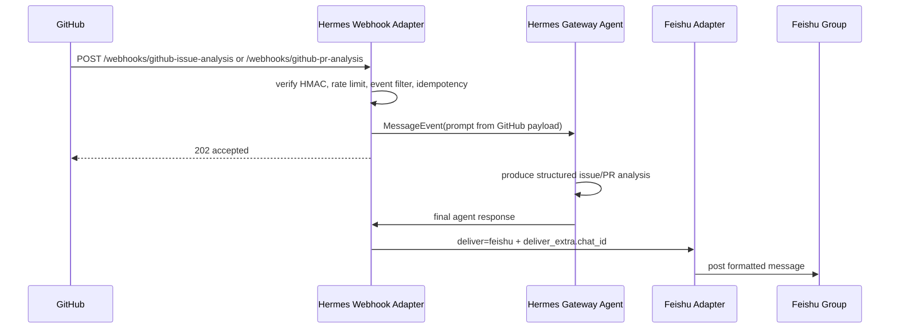

## Overview

在 Hermes 原生能力上搭出一套 MVP：目标 GitHub 仓库出现新的 issue 或 PR 时，自动触发 Hermes agent 分析内容，并把分析结果发送到指定飞书群。

目标：

- 使用 Hermes 现有 webhook platform 接收 GitHub `issues` 和 `pull_request` 事件。
- 使用 Hermes Gateway 自动触发 agent 处理 webhook payload。
- 让 agent 基于 issue/PR 的 title、body、url、repo、author 等信息生成一条结构化分析消息。
- 使用 Hermes 现有 Feishu delivery 能力把 agent response 发送到指定飞书群。
- 先验证 GitHub → Hermes agent → Feishu 的端到端闭环，再决定后续是否需要 Rill 插件。


MVP 范围：

- 只覆盖 GitHub issue opened 和 PR opened 的自动通知分析。
- 只使用 Hermes 原生 webhook route、agent prompt 和 Feishu delivery 配置。
- PR 初版分析基于 webhook payload；代码 diff 级分析作为后续增强。
- 不实现 Rill 插件、持久 watcher、trigger 状态机、retry/replay 或通用事件编排层。


成功标准：

- 新 issue 创建后，飞书群收到一条 agent 生成的分析消息。
- 新 PR 创建后，飞书群收到一条 agent 生成的分析消息。
- 消息包含 repo、编号、标题、作者、链接、摘要、建议处理动作。
- webhook secret、目标 Feishu chat_id、Hermes gateway/Feishu 连接配置缺失时，系统暴露清晰失败信息。

## Research

### Existing System

- 当前 Rill 仓库只包含 specs 与项目元数据，尚无实现代码、测试、运行配置可改。Source: `.` directory entries; glob `src/**`, `**/*.{ts,tsx,js,py,go,rs}`, `**/*test*`
- 当前 active spec 的 MVP 目标是 GitHub issue/PR opened 触发 Hermes agent 分析，并把结构化消息发送到指定飞书群。Source: `specs/change/20260508-hermes-github-feishu-mvp/spec.md:8-35`
- Hermes 已有通用 webhook platform adapter，可接收 GitHub/GitLab/JIRA/Stripe 等 POST，校验 HMAC，按 payload 渲染 prompt，并把 response 发回来源或配置的其他平台。Source: `/Users/william/projects/hermes-agent/gateway/platforms/webhook.py:1-19`
- Webhook route 配置位于 `platforms.webhook.extra.routes`，route 字段包含 `events`、`secret`、`prompt`、`skills`、`deliver`、`deliver_extra`、`deliver_only`。Source: `/Users/william/projects/hermes-agent/gateway/platforms/webhook.py:8-19`
- Webhook 安全与可靠性已有 route-level secret、rate limit、idempotency cache、body size limit；startup 会校验每个 route 有 secret。Source: `/Users/william/projects/hermes-agent/gateway/platforms/webhook.py:21-27,119-127`
- Webhook HTTP endpoint 为 `/webhooks/{route_name}`，health endpoint 为 `/health`。Source: `/Users/william/projects/hermes-agent/gateway/platforms/webhook.py:142-145,254-256`
- Webhook adapter 会先校验 content length、HMAC、rate limit，再解析 JSON/form body；GitHub event 类型来自 `X-GitHub-Event` header。Source: `/Users/william/projects/hermes-agent/gateway/platforms/webhook.py:304-364`
- `events` 过滤只匹配事件类型 header，例如 `issues` 或 `pull_request`；GitHub payload 的 `action` 由 prompt 或后续处理逻辑负责约束。Source: `/Users/william/projects/hermes-agent/gateway/platforms/webhook.py:356-373`
- Prompt template 支持 `{field}` 与 `{nested.field}` dot notation，也支持 `{__raw__}` 输出截断后的完整 payload。Source: `/Users/william/projects/hermes-agent/gateway/platforms/webhook.py:590-628`
- Agent 模式下，webhook adapter 为每个 delivery 构造 `webhook:{route}:{delivery_id}` chat_id，生成 `MessageEvent`，并异步调用 gateway message handler，HTTP 侧立即返回 202。Source: `/Users/william/projects/hermes-agent/gateway/platforms/webhook.py:493-549`
- `deliver_only` 可跳过 agent，把渲染后的 prompt 直接投递；该能力适合零 LLM 成本通知，当前 MVP 的“分析”目标需要 agent 模式。Source: `/Users/william/projects/hermes-agent/gateway/platforms/webhook.py:435-479`
- Webhook response delivery 支持 `github_comment` 与 cross-platform delivery；`feishu` 是内置可识别 deliver platform。Source: `/Users/william/projects/hermes-agent/gateway/platforms/webhook.py:179-228`
- Cross-platform delivery 会查找目标 platform adapter；缺少 gateway runner、未知 platform、platform 未连接、缺少 `chat_id` 且没有 home channel 时返回结构化 `SendResult` error。Source: `/Users/william/projects/hermes-agent/gateway/platforms/webhook.py:728-763`
- Feishu adapter outbound `send` 需要已连接 client；会格式化/分片消息，优先发送 post payload，post payload 被 Feishu 拒绝时回退 plain text，最终返回 `SendResult`。Source: `/Users/william/projects/hermes-agent/gateway/platforms/feishu.py:1697-1752`
- Hermes GitHub PR webhook 指南展示了 route 配置：启用 webhook platform，route 监听 `pull_request`，prompt 从 payload 取 PR 标题、作者、描述、URL，delivery 示例为 `github_comment`。Source: `/Users/william/projects/hermes-agent/website/docs/guides/webhook-github-pr-review.md:37-77`
- GitHub webhook payload 提供 PR 元数据；代码 diff 需要 agent 通过 `gh pr diff {number} --repo {repository.full_name}` 或 GitHub API 另取。Source: `/Users/william/projects/hermes-agent/website/docs/guides/webhook-github-pr-review.md:55-91`
- GitHub repo webhook 设置需要 Payload URL 指向 `/webhooks/<route>`，Content-Type 为 JSON，Secret 与 route secret 一致，并选择 Pull requests / Issues 事件。Source: `/Users/william/projects/hermes-agent/website/docs/guides/webhook-github-pr-review.md:117-124`
- `hermes webhook subscribe` 可写入动态 route，字段包含 `events`、`secret`、`prompt`、`skills`、`deliver`，默认 `deliver: log`。Source: `/Users/william/projects/hermes-agent/hermes_cli/webhook.py:137-157`
- Hermes DeliveryRouter 支持 `platform`、`platform:chat_id`、`platform:chat_id:thread_id` 等 target 形态，并把内容发送给对应 adapter。Source: `/Users/william/projects/hermes-agent/gateway/delivery.py:45-95,129-169`
- 之前的 Rill MVP research 已记录：Hermes 原生快速路径是 `webhook route → agent → Feishu delivery`，可通过 `deliver: feishu` 与 `deliver_extra.chat_id` 把 agent response 发到飞书群。Source: `specs/change/20260507-rill-mvp/spec.md:86,100-102,123-124`

### Available Approaches

- **静态 Hermes config route**：在 Hermes config 中配置一个或两个 route，监听 `issues` 与 `pull_request`，prompt 输出结构化分析，`deliver: feishu` + `deliver_extra.chat_id` 投递飞书群。Source: `/Users/william/projects/hermes-agent/gateway/platforms/webhook.py:8-19,493-549,728-771`
- **动态 `hermes webhook subscribe` route**：用 CLI 写入订阅 route，适合由 agent 或运维脚本创建/更新 route；字段覆盖 events、secret、prompt、skills、deliver。Source: `/Users/william/projects/hermes-agent/hermes_cli/webhook.py:137-157`
- **单 route 监听两类 GitHub 事件**：一个 route 的 `events` 配置为 `issues` 与 `pull_request`，prompt 根据 payload 中 `issue` 或 `pull_request` 字段生成统一结构化消息。Source: `/Users/william/projects/hermes-agent/gateway/platforms/webhook.py:356-379,590-628`
- **双 route 分别处理 issue 与 PR**：issue route 只监听 `issues`，PR route 只监听 `pull_request`，prompt 分别引用 `{issue.*}` 与 `{pull_request.*}` 字段，降低模板分支复杂度。Source: `/Users/william/projects/hermes-agent/website/docs/guides/webhook-github-pr-review.md:49-77`; `/Users/william/projects/hermes-agent/gateway/platforms/webhook.py:590-628`
- **Agent 模式投递 Feishu**：webhook route 触发 agent reasoning，agent response 通过 webhook adapter 的 cross-platform delivery 发送到 Feishu，匹配 MVP 的“分析消息”要求。Source: `/Users/william/projects/hermes-agent/gateway/platforms/webhook.py:493-549,728-771`; `/Users/william/projects/hermes-agent/gateway/platforms/feishu.py:1697-1752`
- **`deliver_only` 直接通知**：route 跳过 agent，把渲染 prompt 直接发到 Feishu，适合健康检查或纯通知。Source: `/Users/william/projects/hermes-agent/gateway/platforms/webhook.py:435-479`

### Constraints & Dependencies

- MVP 依赖外部 Hermes agent 仓库已有 webhook、Gateway、Feishu adapter；Rill 仓库当前没有本地实现代码可直接修改。Source: `.` directory entries; `specs/change/20260508-hermes-github-feishu-mvp/spec.md:21-27`
- Webhook secret 为 route startup 校验项；缺失会抛出清晰 `ValueError`，测试模式显式使用 `INSECURE_NO_AUTH`。Source: `/Users/william/projects/hermes-agent/gateway/platforms/webhook.py:119-127`
- Feishu 目标可通过 `deliver_extra.chat_id` 指定；缺少 chat_id 且 Hermes config 没有 Feishu home channel 时 delivery 返回 `No chat_id or home channel for feishu`。Source: `/Users/william/projects/hermes-agent/gateway/platforms/webhook.py:752-763`
- Feishu adapter 未连接时发送返回 `Not connected`；webhook cross-platform delivery 找不到 adapter 时返回 `Platform feishu not connected`。Source: `/Users/william/projects/hermes-agent/gateway/platforms/feishu.py:1704-1707`; `/Users/william/projects/hermes-agent/gateway/platforms/webhook.py:745-750`
- opened-only 范围需要显式处理 GitHub payload `action`；Hermes route 的 `events` 过滤粒度是 GitHub event type。Source: `/Users/william/projects/hermes-agent/gateway/platforms/webhook.py:356-373`; `/Users/william/projects/hermes-agent/website/docs/guides/webhook-github-pr-review.md:58-71`
- PR 初版基于 webhook payload 可覆盖标题、作者、描述、URL；diff 级分析需要后续启用 GitHub CLI/API 权限。Source: `/Users/william/projects/hermes-agent/website/docs/guides/webhook-github-pr-review.md:55-91`
- GitHub webhook 需要公开可访问的 Hermes webhook URL，GitHub secret 与 route secret 保持一致。Source: `/Users/william/projects/hermes-agent/website/docs/guides/webhook-github-pr-review.md:117-124`
- Webhook POST 会异步触发 agent 并立即返回 202；端到端验证需要同时观察 HTTP accepted、Gateway agent run、Feishu 群消息。Source: `/Users/william/projects/hermes-agent/gateway/platforms/webhook.py:536-549`

### Key References

- `specs/change/20260508-hermes-github-feishu-mvp/spec.md:8-35` - 当前 MVP 目标、范围与成功标准。
- `specs/change/20260507-rill-mvp/spec.md:86,100-102,123-124` - 上一版 research 对 Hermes 原生快速路径的结论。
- `/Users/william/projects/hermes-agent/gateway/platforms/webhook.py:1-27,119-228,300-379,493-549,590-628,728-771` - Webhook adapter 配置、安全、事件过滤、prompt rendering、agent dispatch、Feishu cross-platform delivery。
- `/Users/william/projects/hermes-agent/gateway/platforms/feishu.py:1697-1752` - Feishu outbound send 行为与错误返回。
- `/Users/william/projects/hermes-agent/website/docs/guides/webhook-github-pr-review.md:37-91,117-124` - GitHub webhook route 配置、PR payload 限制、GitHub 设置步骤。
- `/Users/william/projects/hermes-agent/hermes_cli/webhook.py:137-157` - 动态 webhook subscribe route 字段。
- `/Users/william/projects/hermes-agent/gateway/delivery.py:45-95,129-169` - Delivery target 格式与路由结果结构。

## Design

### Architecture Overview



### Change Scope

- Area: Rill spec only. Impact: 本仓库当前没有实现代码、测试或运行配置，设计产物记录 Hermes 外部配置与验证步骤。Source: `specs/change/20260508-hermes-github-feishu-mvp/spec.md:40,72`
- Area: Hermes webhook route config. Impact: 新增两个 route，分别接收 GitHub `issues` 与 `pull_request` 事件，配置 HMAC secret、prompt、`deliver: feishu` 和 `deliver_extra.chat_id`。Source: `/Users/william/projects/hermes-agent/gateway/platforms/webhook.py:8-19`; `/Users/william/projects/hermes-agent/website/docs/guides/webhook-github-pr-review.md:49-77`
- Area: GitHub repository webhook. Impact: 使用当前仓库作为 GitHub issue 与 PR 来源；Payload URL 指向 Hermes `/webhooks/<route>`，content type 使用 JSON，secret 与 route secret 一致，事件选择 Pull requests 与 Issues。Source: `/Users/william/projects/hermes-agent/website/docs/guides/webhook-github-pr-review.md:117-124`; `specs/change/20260508-hermes-github-feishu-mvp/spec.md:23-26`
- Area: Hermes Gateway and Feishu adapter. Impact: webhook adapter 异步触发 agent 并通过 cross-platform delivery 发送到 Feishu 群。Source: `/Users/william/projects/hermes-agent/gateway/platforms/webhook.py:493-549,728-771`; `/Users/william/projects/hermes-agent/gateway/platforms/feishu.py:1697-1752`
- Area: Rollout. Impact: 先在当前仓库和一个飞书群完成端到端验证，再扩展到更多 repo 或 diff 级 PR 分析。Source: `specs/change/20260508-hermes-github-feishu-mvp/spec.md:18,23-27`
- Area: Execution ownership. Impact: GitHub 侧操作由 agent 自动完成；Hermes 配置只允许 agent 做只读检查，配置写入、启动、凭据填充和服务操作由人工完成。Source: `/Users/william/projects/hermes-agent/website/docs/guides/webhook-github-pr-review.md:37-51,96-124`; `/Users/william/projects/hermes-agent/gateway/platforms/webhook.py:119-127`

### Design Decisions

- Decision: 使用 Hermes 原生 `webhook route → agent → Feishu delivery` 路径作为 MVP 主架构。Source: `specs/change/20260508-hermes-github-feishu-mvp/spec.md:14-18`; `/Users/william/projects/hermes-agent/gateway/platforms/webhook.py:1-19,493-549,728-771`
- Decision: 使用两个静态 route：`github-issue-analysis` 与 `github-pr-analysis`。这样 prompt 可直接引用 `{issue.*}` 或 `{pull_request.*}`，模板保持清晰。Source: `/Users/william/projects/hermes-agent/gateway/platforms/webhook.py:8-19,590-628`; `/Users/william/projects/hermes-agent/website/docs/guides/webhook-github-pr-review.md:49-77`
- Decision: route `events` 分别配置为 `issues` 与 `pull_request`，opened-only 由 prompt 明确要求 agent 只处理 `action == opened`。Source: `/Users/william/projects/hermes-agent/gateway/platforms/webhook.py:356-379`; `/Users/william/projects/hermes-agent/website/docs/guides/webhook-github-pr-review.md:58-71`; `specs/change/20260508-hermes-github-feishu-mvp/spec.md:23-26`
- Decision: 使用 agent 模式生成分析消息，保持 `deliver_only` 关闭。MVP 成功标准需要摘要、风险判断和建议动作。Source: `specs/change/20260508-hermes-github-feishu-mvp/spec.md:16-17,31-34`; `/Users/william/projects/hermes-agent/gateway/platforms/webhook.py:435-479,493-549`
- Decision: Feishu 投递使用 `deliver: feishu` 与 `deliver_extra.chat_id`，避免依赖 home channel。Source: `/Users/william/projects/hermes-agent/gateway/platforms/webhook.py:728-763`; `/Users/william/projects/hermes-agent/gateway/platforms/feishu.py:1697-1752`
- Decision: GitHub secret、Feishu chat_id、Feishu adapter 连接作为必需配置暴露；缺失时保留 Hermes 现有失败信号。Source: `/Users/william/projects/hermes-agent/gateway/platforms/webhook.py:119-127,745-763`; `/Users/william/projects/hermes-agent/gateway/platforms/feishu.py:1704-1707`; `specs/change/20260508-hermes-github-feishu-mvp/spec.md:34`
- Decision: PR 初版只基于 webhook payload 元数据，diff 级分析进入后续增强。Source: `specs/change/20260508-hermes-github-feishu-mvp/spec.md:25-26`; `/Users/william/projects/hermes-agent/website/docs/guides/webhook-github-pr-review.md:55-91`
- Decision: 当前仓库作为 MVP 验证 repo，agent 负责 GitHub issue、PR、webhook 配置和 delivery 检查；Hermes runtime 与本地配置由人工修改。Source: `/Users/william/projects/hermes-agent/website/docs/guides/webhook-github-pr-review.md:37-51,117-124`

### Why this design

- 最短路径复用 Hermes 已有 webhook、agent dispatch、cross-platform delivery 与 Feishu adapter，MVP 只需配置和验证。
- 双 route 让 issue 与 PR prompt 独立演进，降低 webhook payload 字段差异带来的模板复杂度。
- agent 模式满足“分析”目标；Feishu delivery 让最终消息落到团队协作群。
- 失败信号沿用现有 Hermes adapter 行为，符合缺失配置时清晰暴露的成功标准。

### Test Strategy

- Config validation: 启动 Hermes Gateway，验证 webhook route secret 缺失时启动失败并显示 route 名称。Source: `/Users/william/projects/hermes-agent/gateway/platforms/webhook.py:119-127`
- Webhook health: 启动后请求 `/health`，确认 webhook adapter 可用。Source: `/Users/william/projects/hermes-agent/gateway/platforms/webhook.py:142-145`; `/Users/william/projects/hermes-agent/website/docs/guides/webhook-github-pr-review.md:96-113`
- Auth validation: 使用错误 GitHub HMAC 调用 route，期待 401 `Invalid signature`。Source: `/Users/william/projects/hermes-agent/gateway/platforms/webhook.py:319-328,555-584`
- Event routing: 向 issue route 发送 `X-GitHub-Event: issues`，向 PR route 发送 `X-GitHub-Event: pull_request`，期待 202 accepted；发送无关 event 期待 ignored。Source: `/Users/william/projects/hermes-agent/gateway/platforms/webhook.py:356-373,536-549`
- End-to-end: 在当前 repo 新建 issue 与 PR，观察 GitHub delivery accepted、Hermes agent run 日志、飞书群消息。Source: `specs/change/20260508-hermes-github-feishu-mvp/spec.md:29-34`; `/Users/william/projects/hermes-agent/gateway/platforms/webhook.py:536-549`
- Failure visibility: Feishu adapter 未连接或 chat_id 缺失时，确认 delivery 返回 `Platform feishu not connected`、`Not connected` 或 `No chat_id or home channel for feishu`。Source: `/Users/william/projects/hermes-agent/gateway/platforms/webhook.py:745-763`; `/Users/william/projects/hermes-agent/gateway/platforms/feishu.py:1704-1707`

### Pseudocode

Hermes config sketch:

```yaml
platforms:
  webhook:
    enabled: true
    extra:
      port: 8644
      rate_limit: 30
      routes:
        github-issue-analysis:
          secret: ${GITHUB_WEBHOOK_SECRET}
          events: [issues]
          prompt: |
            GitHub issue webhook received. action={action}
            Only analyze when action is "opened".

            Repo: {repository.full_name}
            Issue: #{issue.number} {issue.title}
            Author: {issue.user.login}
            URL: {issue.html_url}
            Body: {issue.body}

            Send a concise Chinese analysis with: repo, number, title, author, link,
            summary, impact/risk, suggested owner/action, and priority.
          deliver: feishu
          deliver_extra:
            chat_id: ${FEISHU_CHAT_ID}

        github-pr-analysis:
          secret: ${GITHUB_WEBHOOK_SECRET}
          events: [pull_request]
          prompt: |
            GitHub pull request webhook received. action={action}
            Only analyze when action is "opened".

            Repo: {repository.full_name}
            PR: #{pull_request.number} {pull_request.title}
            Author: {pull_request.user.login}
            Branch: {pull_request.head.ref} -> {pull_request.base.ref}
            URL: {pull_request.html_url}
            Body: {pull_request.body}

            Send a concise Chinese analysis with: repo, number, title, author, link,
            summary, review focus, potential risk, suggested reviewer/action, and priority.
          deliver: feishu
          deliver_extra:
            chat_id: ${FEISHU_CHAT_ID}
```

Flow:

1. Operator configures Hermes webhook platform, Feishu credentials, target `FEISHU_CHAT_ID`, and `GITHUB_WEBHOOK_SECRET`.
2. Agent registers GitHub webhooks on the current repository after operator provides public base URL and webhook secret.
3. GitHub sends event with `X-GitHub-Event` and HMAC signature.
4. Hermes validates body size, signature, rate limit, event filter, and idempotency.
5. Hermes renders route prompt from payload fields and creates one webhook-scoped `MessageEvent`.
6. Agent generates a structured Chinese issue/PR analysis.
7. Webhook adapter sends final response through Feishu adapter to `FEISHU_CHAT_ID`.
8. Operator verifies accepted HTTP response, Hermes logs, and Feishu group output.

### File Structure

- `specs/change/20260508-hermes-github-feishu-mvp/spec.md` - MVP design, plan, verification notes。
- `/Users/william/projects/hermes-agent` - Hermes external runtime/config target for implementation and validation。
- `~/.hermes/config.yaml` - expected local Hermes Gateway configuration location from Hermes guide。Source: `/Users/william/projects/hermes-agent/website/docs/guides/webhook-github-pr-review.md:37-51`

### Interfaces / APIs

- HTTP: `POST /webhooks/github-issue-analysis` receives GitHub issue events。Source: `/Users/william/projects/hermes-agent/gateway/platforms/webhook.py:142-145`
- HTTP: `POST /webhooks/github-pr-analysis` receives GitHub PR events。Source: `/Users/william/projects/hermes-agent/gateway/platforms/webhook.py:142-145`
- HTTP: `GET /health` verifies webhook adapter health。Source: `/Users/william/projects/hermes-agent/gateway/platforms/webhook.py:142-145`
- GitHub headers: `X-GitHub-Event`, `X-GitHub-Delivery`, `X-Hub-Signature-256` drive event routing, idempotency, and HMAC auth。Source: `/Users/william/projects/hermes-agent/gateway/platforms/webhook.py:356-364,410-414,555-565`
- Prompt template: `{field}` and `{nested.field}` read GitHub payload fields。Source: `/Users/william/projects/hermes-agent/gateway/platforms/webhook.py:590-628`
- Delivery: `deliver: feishu` with `deliver_extra.chat_id` routes final response to Feishu。Source: `/Users/william/projects/hermes-agent/gateway/platforms/webhook.py:205-223,728-771`

### Edge Cases

- GitHub sends `issues` or `pull_request` actions such as edited, closed, reopened: prompt instructs agent to stop after identifying non-opened action。Source: `/Users/william/projects/hermes-agent/gateway/platforms/webhook.py:356-379`; `/Users/william/projects/hermes-agent/website/docs/guides/webhook-github-pr-review.md:58-71`
- Duplicate GitHub deliveries: webhook adapter uses delivery ID idempotency cache and returns duplicate status。Source: `/Users/william/projects/hermes-agent/gateway/platforms/webhook.py:416-433`
- Payload too large: webhook adapter returns 413 before full processing。Source: `/Users/william/projects/hermes-agent/gateway/platforms/webhook.py:304-310`
- Invalid or missing signature: webhook adapter returns 401 with invalid signature。Source: `/Users/william/projects/hermes-agent/gateway/platforms/webhook.py:319-328,555-584`
- Feishu post formatting rejected: Feishu adapter falls back to plain text, preserving delivery attempt visibility through `SendResult`。Source: `/Users/william/projects/hermes-agent/gateway/platforms/feishu.py:1712-1752`
- Missing Feishu chat target: cross-platform delivery returns a structured error。Source: `/Users/william/projects/hermes-agent/gateway/platforms/webhook.py:752-763`

## Plan

- [ ] Step 1: Agent 只读盘点当前仓库与 GitHub 远端
  - [ ] Substep 1.1 Verify: 读取当前 git remote，确认当前仓库对应的 GitHub `owner/repo`。
  - [ ] Substep 1.2 Verify: 使用 GitHub CLI 读取 repo 信息，确认 agent 具备 issue、PR、webhook 相关 GitHub 操作权限。
  - [ ] Substep 1.3 Verify: 检查当前工作区状态，记录可用于测试 PR 的安全变更策略。
  - [ ] Substep 1.4 Verify: 检查当前仓库已有 open issues 与 open PR，避免测试标题冲突。
  - [ ] Substep 1.5 Verify: 记录 repo、默认分支、测试分支命名、测试 issue 标题、测试 PR 标题到 Notes。
- [ ] Step 2: Agent 只读检查 Hermes 本地状态
  - [ ] Substep 2.1 Verify: 读取 Hermes config 路径是否存在，记录实际路径与可见配置键。
  - [ ] Substep 2.2 Verify: 检查 webhook platform 是否已启用、端口、rate limit、routes 配置是否可见。
  - [ ] Substep 2.3 Verify: 检查 Feishu platform 配置是否存在，记录 chat_id/home channel 是否可见。
  - [ ] Substep 2.4 Verify: 检查 Hermes webhook health endpoint 是否已有本地服务响应。
  - [ ] Substep 2.5 Verify: 输出人工配置所需的缺口清单，不修改 Hermes 配置、不启动或停止 Hermes 服务。
- [ ] Step 3: 人工配置 Hermes webhook 与 Feishu delivery
  - [ ] Substep 3.1 Implement: 在 Hermes 本地配置中启用 webhook platform，设置端口与 rate limit。
  - [ ] Substep 3.2 Implement: 配置 `github-issue-analysis` route：secret、`events: [issues]`、issue prompt、`deliver: feishu`、`deliver_extra.chat_id`。
  - [ ] Substep 3.3 Implement: 配置 `github-pr-analysis` route：secret、`events: [pull_request]`、PR prompt、`deliver: feishu`、`deliver_extra.chat_id`。
  - [ ] Substep 3.4 Implement: 填入 Feishu 凭据、目标群 `chat_id`、GitHub webhook secret。
  - [ ] Substep 3.5 Implement: 启动或重启本地 Hermes Gateway，使 webhook 与 Feishu adapter 生效。
  - [ ] Substep 3.6 Verify: 人工访问 `/health`，确认 webhook adapter 返回 ok。
  - [ ] Substep 3.7 Verify: 人工确认 Hermes 日志显示两个 route 已加载，并记录端口与公开 webhook base URL。
- [ ] Step 4: Agent 自动配置当前仓库 GitHub webhooks
  - [ ] Substep 4.1 Implement: 使用 GitHub CLI 或 GitHub API 在当前仓库创建 issue route webhook，Payload URL 为 `<public-base-url>/webhooks/github-issue-analysis`。
  - [ ] Substep 4.2 Implement: 设置 issue webhook content type 为 JSON，secret 使用人工提供的同一 webhook secret，事件选择 Issues。
  - [ ] Substep 4.3 Implement: 使用 GitHub CLI 或 GitHub API 在当前仓库创建 PR route webhook，Payload URL 为 `<public-base-url>/webhooks/github-pr-analysis`。
  - [ ] Substep 4.4 Implement: 设置 PR webhook content type 为 JSON，secret 使用人工提供的同一 webhook secret，事件选择 Pull requests。
  - [ ] Substep 4.5 Verify: 读取当前仓库 webhook 列表，确认两个 webhook active、URL、content type、event 配置正确。
  - [ ] Substep 4.6 Verify: 触发 GitHub webhook ping 或查看 recent delivery，确认 GitHub 侧 delivery 能访问 Hermes 公开 URL。
- [ ] Step 5: Agent 自动触发 issue webhook 验证
  - [ ] Substep 5.1 Implement: 在当前仓库创建测试 issue，标题使用固定前缀 `[Hermes MVP Test] issue opened`。
  - [ ] Substep 5.2 Verify: 读取 GitHub webhook recent deliveries，确认 issue route 收到 `issues` / `opened` delivery。
  - [ ] Substep 5.3 Verify: 确认 delivery HTTP response 为 202 accepted，记录 delivery ID。
  - [ ] Substep 5.4 Implement: 在测试 issue 添加评论，记录 GitHub delivery ID 与 HTTP response。
- [ ] Step 6: 人工确认 issue 飞书消息
  - [ ] Substep 6.1 Verify: 在飞书群查找 `[Hermes MVP Test] issue opened` 对应分析消息。
  - [ ] Substep 6.2 Verify: 确认消息包含 repo、编号、标题、作者、链接、摘要、建议处理动作。
  - [ ] Substep 6.3 Verify: 记录 issue 飞书消息时间、可见内容摘要、异常现象。
  - [ ] Substep 6.4 Verify: 把确认结果反馈给 agent，用于写入 spec Notes 与 issue 评论。
- [ ] Step 7: Agent 自动触发 PR webhook 验证
  - [ ] Substep 7.1 Implement: 基于当前仓库创建测试分支，提交一个无害文档或 spec Notes 更新。
  - [ ] Substep 7.2 Implement: 打开测试 PR，标题使用固定前缀 `[Hermes MVP Test] PR opened`。
  - [ ] Substep 7.3 Verify: 读取 GitHub webhook recent deliveries，确认 PR route 收到 `pull_request` / `opened` delivery。
  - [ ] Substep 7.4 Verify: 确认 delivery HTTP response 为 202 accepted，记录 delivery ID。
  - [ ] Substep 7.5 Implement: 在测试 PR 添加评论，记录 GitHub delivery ID 与 HTTP response。
- [ ] Step 8: 人工确认 PR 飞书消息
  - [ ] Substep 8.1 Verify: 在飞书群查找 `[Hermes MVP Test] PR opened` 对应分析消息。
  - [ ] Substep 8.2 Verify: 确认消息包含 repo、编号、标题、作者、链接、摘要、建议处理动作。
  - [ ] Substep 8.3 Verify: 记录 PR 飞书消息时间、可见内容摘要、异常现象。
  - [ ] Substep 8.4 Verify: 把确认结果反馈给 agent，用于写入 spec Notes 与 PR 评论。
- [ ] Step 9: Agent 自动整理验证记录与清理 GitHub 测试资源
  - [ ] Substep 9.1 Implement: 更新 spec Notes，记录 GitHub repo、webhook IDs、test issue URL、test PR URL、delivery IDs、人工 Feishu 确认结果。
  - [ ] Substep 9.2 Implement: 关闭测试 issue，并添加最终验证评论。
  - [ ] Substep 9.3 Implement: 关闭测试 PR，并删除测试分支。
  - [ ] Substep 9.4 Verify: 读取当前仓库 issue 与 PR 状态，确认测试资源已关闭。
  - [ ] Substep 9.5 Verify: 读取 GitHub webhook 列表，确认 MVP 所需 webhooks 保留 active。

## Notes

<!-- Optional sections — add what's relevant. -->

### Implementation

- Rill execution log: `specs/change/20260508-hermes-github-feishu-mvp/steps.md` records Steps 1-9, deviations, delivery IDs, manual confirmations, and cleanup.
- GitHub repo: `nettee/rill`, default branch `main`.
- GitHub webhooks retained active:
  - Issue hook `619555132`: `https://drinking-anne-proposition-quiz.trycloudflare.com/webhooks/github-issue-analysis`, event `issues`, content type `json`.
  - PR hook `619555148`: `https://drinking-anne-proposition-quiz.trycloudflare.com/webhooks/github-pr-analysis`, event `pull_request`, content type `json`.
- Hermes local config changed in `/Users/william/.hermes/config.yaml`:
  - `platforms.webhook.enabled=true`
  - `platforms.webhook.extra.port=8644`
  - `platforms.webhook.extra.rate_limit=30`
  - route `github-issue-analysis`: secret, `events: [issues]`, `actions: [opened]`, issue prompt, `deliver: feishu`, `deliver_extra.chat_id: oc_3218e07b3504dd0635bbd10fd4872cab`
  - route `github-pr-analysis`: same secret, `events: [pull_request]`, `actions: [opened]`, PR prompt, `deliver: feishu`, same `chat_id`
  - `platforms.feishu.enabled=true`; Feishu credentials/connection came from the existing local Hermes setup.
- Hermes source changed to support action-level filtering:
  - `/Users/william/projects/hermes-agent/gateway/platforms/webhook.py`
  - `/Users/william/projects/hermes-agent/tests/gateway/test_webhook_adapter.py`
  - Hermes commit: `a4349304c step: add webhook action filtering`
  - Runtime copy patched: `/Users/william/.hermes/hermes-agent/gateway/platforms/webhook.py`
- Prompt correction: issue/PR prompts now instruct the agent to return analysis text only and let webhook delivery send to Feishu. This prevents the agent from using the Feishu tool and sending full content to the home channel.
- Deviation: `pull_request/synchronize` originally produced an extra Feishu no-op message. Added route `actions: [opened]` support so non-opened actions are ignored before agent dispatch.

### Verification

- Hermes health: `curl -i http://localhost:8644/health` returned `HTTP/1.1 200 OK` and `{"status":"ok","platform":"webhook"}`.
- Hermes gateway log confirmed: `[webhook] Listening on 0.0.0.0:8644 — routes: github-issue-analysis, github-pr-analysis`.
- GitHub webhook ping deliveries returned 200 OK for both hooks.
- Issue opened delivery:
  - Test issue #1: `https://github.com/nettee/rill/issues/1`
  - Delivery id `3818703523336421400`, `issues/opened`, HTTP `202`
  - Initial Feishu result exposed the prompt/tool routing issue.
- Issue retry after prompt fix:
  - Retry issue #2: `https://github.com/nettee/rill/issues/2`
  - Delivery id `3818704905724494000`, `issues/opened`, HTTP `202`
  - Manual Feishu confirmation: target group `[H] Rill 测试` received full issue analysis.
- PR opened delivery:
  - Test PR #3: `https://github.com/nettee/rill/pull/3`
  - Delivery id `3818706595582312400`, `pull_request/opened`, HTTP `202`
  - Manual Feishu confirmation: target group received full PR analysis.
- Action filter verification:
  - Test command: `/Users/william/.hermes/hermes-agent/venv/bin/python -m pytest tests/gateway/test_webhook_adapter.py -q`
  - Result: `38 passed`
  - Local signed `pull_request/synchronize` smoke request returned `HTTP/1.1 200 OK` with `{"status":"ignored","event":"pull_request","action":"synchronize"}`.
  - Post-fix GitHub `pull_request/synchronize` delivery id `3818708026712391700` returned status_code `200`, confirming ignore-before-agent behavior.
- Cleanup:
  - Issue #1 closed.
  - Issue #2 closed.
  - PR #3 closed.
  - Remote branch `origin/hermes-mvp-test-20260508` deleted.
  - Webhooks `619555132` and `619555148` remain active.
